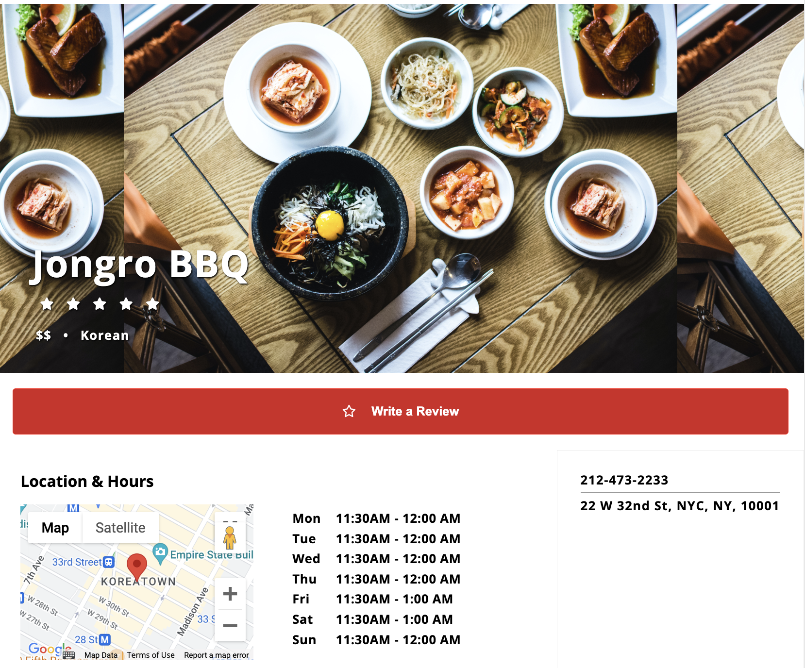

# Welcome to peepoHungry!
Inspired by my appreciation for Pepe the frog, also known as Peepo, I created my Yelp! clone based around him. peepoHungry is an application that provides crowd-sourced reviews and rating for various businesses, including restaurants, bars and cafes.


# Technologies, Libraries, APIs
- Languages: JavaScript, HTML, Ruby, and CSS
- Frontend: React, Redux
- Backend: Ruby on Rails
- Database: PostgreSQL
- Hosting: Render
- Asset Storage: Amazon S3

# Code Snippet 
Users are allowed to write one review per business.  By checking the state for all reviews for the specified business and filtering for the session user's id within the posted reviews, logged in users are greeted with either a 'Write a Review' or 'Update Your Review' button.

``` js
if (!sessionUser) {
        sessionUser = {};
}

const reviews = useSelector(state => {
    return Object.values(state.reviews).filter(review => review.businessId === Number(businessId))
})

const handleNew = e => {
    e.preventDefault();
    nav(`/businesses/${businessId}/write-a-review`)
}

const handleUpdate = e => {
    e.preventDefault();
    nav(`/businesses/${businessId}/${userReviewId}/edit`)
}

const userReview = reviews.find(review => review.userId === sessionUser.id); 

const userReviewId = userReview ? userReview.id : null; 

const reviewButton = userReview ? 
    ( <button type="submit" id="rev-sub-btn" onClick={handleUpdate}><i id="rev-sub-star" className="far fa-star"></i>Update Your Review</button>) 
    : 
    (<button type="submit" id="rev-sub-btn" onClick={handleNew}><i id="rev-sub-star" className="far fa-star"></i>Write a Review</button>);
```




# Future Implementations  
Features coming to peepoHungry include:
- Search bar filering
- User profiles
- User ability to upload images in their review submission


